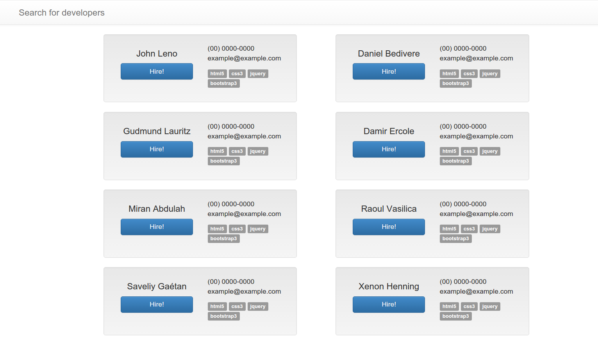
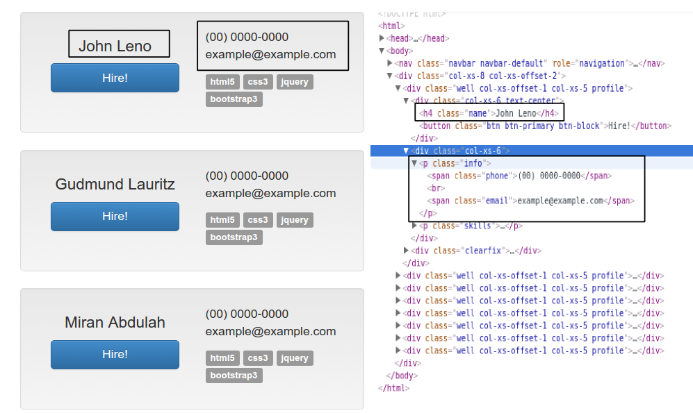
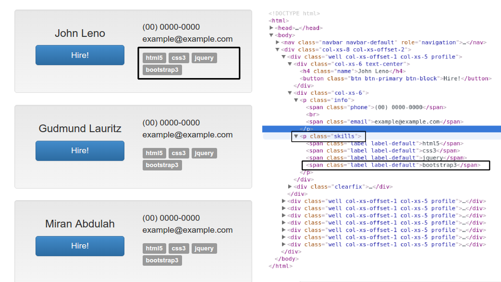

Tutorial - Starting a new project
===================================

Clone our project template
-------------------------------

Our project template uses a lib called `cookiecutter <http://cookiecutter.readthedocs.org/en/latest/>`_, so the first step is to install it using the pip.

.. code-block:: bash
    
    $ pip install cookiecutter

Now, use the cookiecutter command line to clone our project template and boot a new project. Questions will be made to config your project during this process.

.. code-block:: bash
    
    $ cookiecutter gh:intelivix/scrapy-venom

.. note::
    It's strongly recommended to use `Virtualenv <https://virtualenv.readthedocs.org/en/latest/>`_ and `Virtualenvwrapper <https://virtualenvwrapper.readthedocs.org/en/latest/>`_

Create the first SpiderStep
-------------------------------

It's very important to have a well-defined objective for the implementation of a spider. So let us contextualize our problem:

    John is a programmer and will work on a big project. When searching for other backend developers to collaborate, he found a site named devjobs.com that lists several developers and their skills. Now, he needs a spider that seeks all contacts of the developers and their skills.

Okay, now our goal is defined, we need to **get all contacts of backend developers and their skills at devjobs.com**.
For achieve this goal, we need to execute some steps:

* Get all contacts of backend developers
* Get all skills from these developers

Now that we know what we should do, let's have some fun!     

To create our first spider, use the scrapy-venom command-line :func:`start_spider`

.. code-block:: bash

    $ venom startspider devjobs

The new spider was created at ``project.spiders.devjobs`` with the following files:

* ``__init__.py``
* ``items.py``
* ``pipelines.py``
* ``spiders.py``
* ``steps.py``
* ``models.py``

The files ``items.py``, ``pipelines.py``, ``spiders.py`` are defined at `Scrapy documentation <http://doc.scrapy.org/en/latest/>`_. The file ``models.py`` defines our tables of database. The most diferent file is ``steps.py`` which defines the steps to achieve the goal of the current spider. After create the new spider, set the spider name into settings.

.. code-block:: python
    :emphasize-lines: 5
    
    # ADD THE NEW SPIDER

    SPIDER_MODULES = register_spiders(
        'sample',
        'devjobs'
    )

Our spider was created with some basic attributes. The ``name`` attribute defines how we call this spider in command line. ``initial_url`` defines the url which this spider will request when executed. The property ``initial_step`` defines the initial step which will process the response from ``initial_url``.

.. code-block:: python
    
    # devjobs/spiders.py
    # -*- coding: utf-8 -*-

    from scrapy_venom.spiders import SpiderStep

    class DevjobsSpider(SpiderStep):

        name = 'devjobs-spider'
        initial_url = ''
        initial_step = None

First, define the attribute ``initial_url`` with the value ``https://www.devjobs.com`` and determine the params to be searched with the property ``payload``. In this example, the spider will make a GET request in url ``https://www.devjobs.com?q=backend``

.. code-block:: python

    # devjobs/spiders.py
    # -*- coding: utf-8 -*-

    from scrapy_venom.spiders import SpiderStep

    class DevjobsSpider(SpiderStep):

        name = 'devjobs-spider'
        initial_url = 'https://www.devjobs.com'
        initial_step = None

        @property
        def payload(self):
            return {'q': 'backend'}

Defining our items
--------------------

As we had set in our context, we need of contact of backend developers and their skills.

Looking the devjobs.com we can see that contact infos are ``name``, ``phone`` and ``email``. In the section of skills, we can see that one developer can have multiple skills. So we need two items: ``items.Contact`` and ``items.Skill``.

.. code-block:: python
    
    # devjobs/items.py
    # -*- coding: utf-8 -*-

    from scrapy import Item
    from scrapy import Field

    class Contact(Item):
        name = Field()
        phone = Field()
        email = Field()

    class Skill(Item):
        contact = Field()
        name = Field()

Get all contacts of backends in Devjobs
----------------------------------------

To get all contacts, we will use the ``items.Contact`` defined previously. Let's define our first step.

.. code-block:: python
    :emphasize-lines: 14

    # devjobs/spiders.py
    # -*- coding: utf-8 -*-

    from scrapy_venom.spiders import SpiderStep
    from .steps import ContactStep

    class DevjobsSpider(SpiderStep):

        name = 'devjobs-spider'
        initial_url = 'https://www.devjobs.com'
        initial_step = ContactStep

        @property
        def payload(self):
            return {'q': 'backend'}

.. code-block:: python

    # devjobs/steps.py
    # -*- coding: utf-8 -*-

    from scrapy_venom.steps import Step

    class ContactStep(Step):

        def crawl(self, selector):
            pass

The implementation of the method :func:`crawl` is required and it's used to navigate the html. One step should do only one thing to achieve the goal of the spider. In our case, we want our step to save all contact of developers on the current page, and for this, we need define a ``scrapy.Item`` in the attribute ``item_class``.

.. code-block:: python

    # devjobs/steps.py
    # -*- coding: utf-8 -*-

    from scrapy_venom.steps import Step
    from .items import Contact

    class ContactStep(Step):

        item_class = Contact

        def crawl(self, selector):
            pass

Now, we can start to crawl the response. Using xpath, we will get navigate the html and get all contact info. In the method :func:`crawl`, use ``yield`` to create a promise of a list of links. The spider will process and iterate over the method :func:`clean_item` which returns a dict. Automatically, the spider will build the item_class ``items.Link``.

.. code-block:: python

    # devjobs/steps.py
    # -*- coding: utf-8 -*-

    from scrapy_venom.steps import Step
    from .items import Contact

    class ContactStep(Step):

        item_class = Contact
        next_step = SkillStep

        def extract_item(self, selector):
            extraction = []
            extraction += selector.xpath('.//span[@class="name"]').extract()
            extraction += selector.xpath('.//span[@class="phone"]').extract()
            extraction += selector.xpath('.//span[@class="email"]').extract()
            return extraction

        def clean_item(self, extraction):
            cleaned_item = {}
            cleaned_item['name'] = extraction[0].strip()
            cleaned_item['phone'] = extraction[1].strip()
            cleaned_item['email'] = extraction[2].strip()
            return cleaned_item

        def build_item(self, cleaned_item, **kwargs):
            yield self.item_class(**cleaned_item)
            yield self.call_next_step(item, kwargs['selector'])

        def call_next_step(self, item, selector):
            for item in self.call_next_step(selector, context={'contact': item}):
                yield item

        def crawl(self, selector):
            yield selector.xpath('//div[@class="profile"]')

    class SkillStep(Step):

        item_class = Skill

        def clean_item(self, extraction):
            cleaned_item = {}
            cleaned_item['name'] = extraction
            cleaned_item['contact'] = self.contact
            return cleaned_item

        def crawl(self, selector):
            yield selector.xpath('.//span[@class="label"]')

.. code-block:: python

    # -*-coding: utf-8 -*-

    from scrapy_venom.steps import Step
    from .items import Contact

    class ContactStep(Step):

        item_class = Contact

        def extract_item(self, selector):
            return selector

        # receives every contact, one by one
        def clean_item(self, extraction):
            cleaned_data = {}
            cleaned_data['name'] = extraction.strip()
            cleaned_data['email'] = extraction.strip()
            cleaned_data['phone'] = extraction.strip()
            return cleaned_data

        def crawl(self, selector):
            # promises a list of profiles
            yield selector.xpath('//p[@class="profile"]/')

Okay, now we have completed the first step to achieve our goal. Executing this spider in the terminal by command ``scrapy crawl google-step -t json -o links.json``, we have the result of the first step in the file ``links.json``.

.. code-block:: json
    
    [
    {"url": "https://www.what-is-social-network.com"},
    {"url": "https://www.socialnetworks.com"},
    {"url": "https://www.samplesocial.com"}
    ]

Our next problem is "get all images", but in the current page doesn't have any images. We need to upgrade our step to pass to the next step the right page. The comunication between steps are given by the dict attribute ``next_step_kwargs``. To pass the right page to the next step, we need to fill ``next_step_kwargs['request_url']`` with the url of images.

.. code-block:: python
    :emphasize-lines: 24

    # -*-coding: utf-8 -*-

    from scrapy_venom.steps import Step
    from .items import LinkItem

    class LinkStep(Step):

        item_class = LinkItem

        # receives every link, one by one
        def clean_item(self, extraction):
            # assuming that the links will be poor like:
            # >> 'https://www.facebook.com\n\t\t\b'
            # we will clean with .strip()
            cleaned_data = {}
            cleaned_data['url'] = extraction.strip()
            return cleaned_data

        def crawl(self, selector):
            # promises a list of hrefs
            yield selector.xpath('//a/@href')

            # passing the next url to be accessed
            self.next_step_kwargs['request_url'] = self.get_images_link(selector)

        def get_images_link(self, selector):
            # searchs for <a href="#"> that contains "Image"
            url = selector.xpath(
                '//a/text() == "Images"').xpath('./@href').extract()[0]
            return 'https://www.google.com' + url

.. seealso::
    
    `click here to see how use the Xpath syntax <http://www.w3schools.com/xsl/xpath_syntax.asp>`_

    

Get all images from Google
----------------------------------

As we had set in our context, now we need to get all image of the search images page. With the response from ``https://www.google.com?q=social+network&tbm=isch`` requested from previous step, we can define our new step. We don't need create any new item, because we don't want to save the images, only get this links to access other time. So, let's code!

.. code-block:: python
    
    # google/spiders.py
    # -*- coding: utf-8 -*-

    from scrapy_venom.spiders import SpiderStep
    from .steps import LinkStep
    from .steps import ImageStep

    class GoogleSpider(SpiderStep):

        name = 'google-spider'
        initial_url = 'https://www.google.com'

        @property
        def payload(self):
            return {'q': 'social network'}

        @property
        def steps(self):
            return (LinkStep, ImageStep)

.. code-block:: python

    # -*-coding: utf-8 -*-

    from scrapy_venom.steps import Step
    from .items import LinkItem

    class ImageStep(Step):

        item_class = LinkItem

        def clean_item(self, extraction):
            cleaned_data = {}
            cleaned_data['url'] = extraction.strip()
            return cleaned_data

        def crawl(self, selector):
            # promises a list of srcs
            yield selector.xpath('//img/@src')

.. code-block:: json

    [
    {"url": "https://www.what-is-social-network.com"},
    {"url": "https://www.socialnetworks.com"},
    {"url": "https://www.samplesocial.com"},
    {"url": "https://www.samplesocial.com/images/example.png"},
    {"url": "https://www.samplesocial.com/images/logo.png"},
    ]

Store the links in a database
----------------------------------

Store the images in a database
----------------------------------
